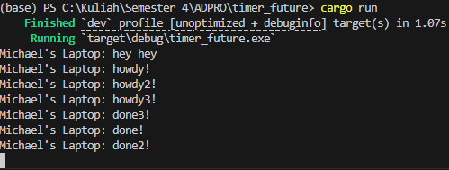

# module-10

## 1.2

Pada gambar terlihat bahwa string "Michael's Laptop: hey hey" (akan disebut sebagai string A untuk mempersingkat) berada di atas "Michael's Laptop: howdy!" (akan disebut sebagai string B untuk mempersingkat). Hal ini dikarenakan kode yang berada pada fungsi yang asynchronous membutuhkan waktu untuk dijadwalkan terlebih dahulu sebelum dieksekusi, sedangkan kode yang berada langsung tanpa fungsi asynchronous dapat langsung dijalankan. Inilah yang menyebabkan string A berada di atas string B. Meskipun program yang menghasilkan string B sudah dijalankan, namun masih dijadwalkan dan belum dieksekusi.

## 1.3
Hasil replikasi spawn dan menghapus `drop(spawner)`:

Hasil replikasi spawn tanpa menghapus `drop(spawner)`:

Ketika terjadi replikasi spawn, terlihat bahwa urutan pesan yang keluar menjadi teracak antara pesan 1, 2, dan 3. Hal ini dikarenakan masing-masing pesan memiliki thread sendiri dan setiap thread berjalan pada saat yang bersamaan sehingga masing-masing thread memiliki kemungkinan untuk selesai terlebih dahulu. Kemudian fungsi dari `drop(spawner)` adalah untuk menghentikan operasi setelah semua pesan terkirim. Hal ini dapat terlihat karena jika `drop(spawner)` dihapus maka program akan tetap berjalan meskipun setiap pesan sudah dikirim.